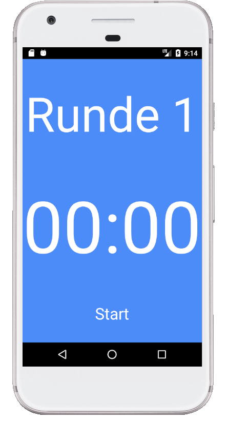

# Vojta App

Vojta App is a simple, browser-based timer application designed to keep track of total elapsed time and round-based intervals. It is ideal for exercises, workout routines, or any activities that require timed rounds. The app features a clean, easy-to-use interface with interactive elements to start, stop, and reset timers.

## Features

- **Total Timer**: Tracks the overall elapsed time since the session started.
- **Round Timer**: Tracks the time elapsed within the current round.
- **Round Counter**: Keeps count of the number of rounds completed.
- **Interactive Controls**: Clickable elements to start/reset the timers and advance rounds.

## Usage

1. **Start/Reset Total Timer and First Round**: Click on the total timer display. This will start or reset both the total timer and the round timer, and reset the round counter to 1.
2. **Advance to Next Round**: Click on the round counter display. This will increment the round counter and reset the round timer.
3. **Reset Round Timer**: Click on the round timer display. This will reset the round timer while keeping the total timer running.

 

